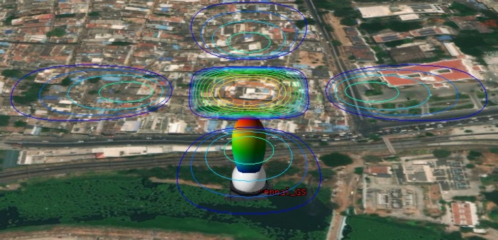
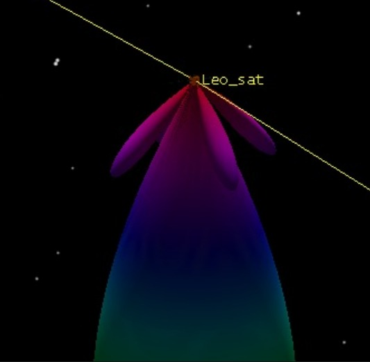
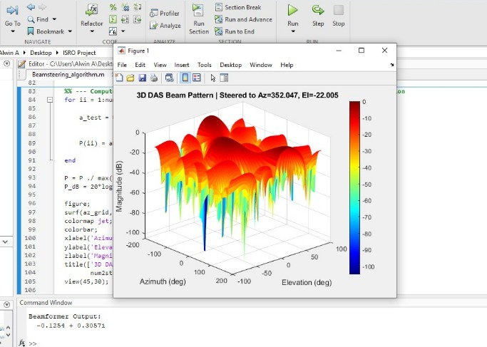

# ***Satellite Beamforming :***
*This project demonstrates satellite beam steering using STK-driven orbital geometry and Delay-and-Sum beamforming in MATLAB.*  
*Azimuth and Elevation data from STK are used to compute URA steering vectors and DAS weights.*  
*The beamformer output Y = Wᴴ X and radiation pattern are evaluated to visualize real-time satellite tracking.*

## ***Vision of this project :***
Is to implement a real beamsteering simulation using a 2 X 2 mimo based SDR ( BladeRF XA4 ) using steering vectors and to compute a real narrowband beamformer Minimum Variance Distortionless Response (MVDR) with mathematically accurate computation in MATLAB as possible and to perform it on many more advanced hardware .

### ***Master File :***
This file calls STK application (ver 11) from MATLAB then creates Satellite and Ground Station using .NewChildren function, 
then gets the azimuth and elevation angle using the function aer() ( which is a inbuilt function of Ansys STK )
then it computes the steering vector -> weight -> DAS Beamformer 
then plots the graph for one particular angular position of the sateillite from that bunch ( azimuth(i) , elevation(i) ).

### ***Slave file 1 ( URA_vector ) :***
This function file computes the steering vector using the angle recieved from Ansys STK which is Azimuth and Elevation .

***definition :*** the steering vector is a matrix that represents the relative phase of each element.
### ***Ground Station Beam :***
  

### ***Satellite Beam :***
  

### ***Beam Pattern :***

### ***Reference :***
[Information about MUSIC used for DOA estimation (future works)](https://forums.ni.com/t5/LabVIEW/Steering-Vector-of-the-Vector-Antenna-in-LabView/td-p/4220010)  
[Inspiration to improve the steering vector](https://www.sharetechnote.com/html/TechSlide/html/antennaRadiation_Steering_exp_var_p_01.html)  

### ***Problems yet to solve :***
